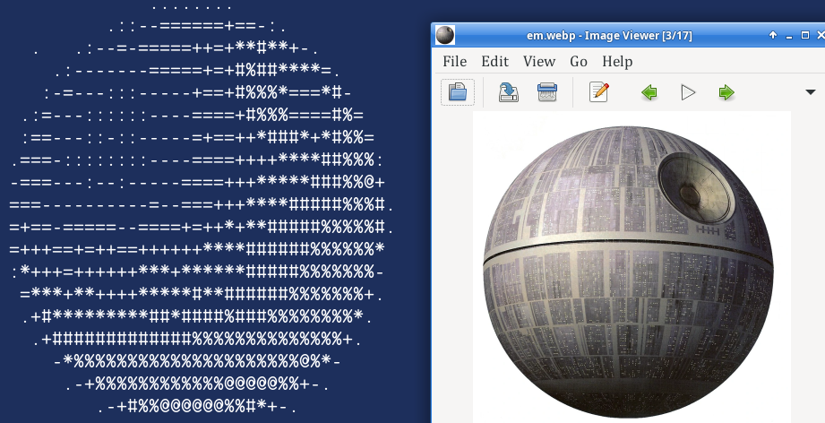
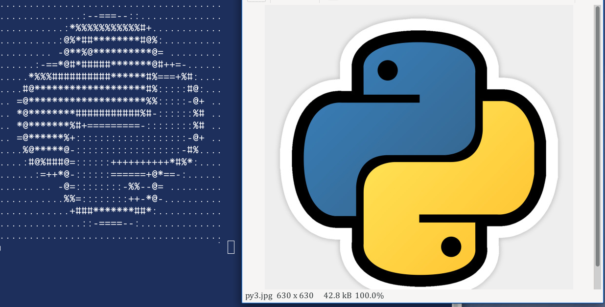

# asciification

A very basic CLI script to transform an image into [ASCII art](https://en.wikipedia.org/wiki/ASCII_art).

## Images




## Requirements

- It requires [Pillow](https://pillow.readthedocs.io)
    ```bash
    python3 -m pip install --upgrade pip
    python3 -m pip install --upgrade Pillow
    ```
- Local image in one of the available formats (`jpeg`, `webp`, `png`)

## Commands

- Flags (`-c or --contrast`, `-b or --brightness`, `-h or --help`)

## How to launch it

1. Clone the repository:
   ```bash
   git clone https://github.com/davideaded/asciification.git
   cd asciification
   ```
2. Run python3 ./main.py fileImg 
or
- python3 ./main.py --help to display help
